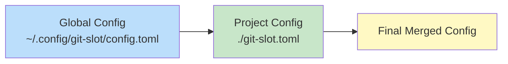

# 設定システム

## 1. Overview

Git Slot は階層型の TOML 設定システムを採用する。スロットの名前・数はすべて設定ファイルで定義し、ハードコードされたプリセットは持たない。プロジェクト固有の設定とユーザーグローバルの設定を階層的にマージする。

設定ファイルが存在しない場合はエラーとし、`git slot --init` での明示的な初期化を求める。

## 2. PRD (Product Requirements)

### 2.1 User Stories

#### US-CFG-001: プロジェクト固有の設定

> チームリーダーとして、リポジトリにプロジェクト固有のスロット設定を含めたい。それにより、チームメンバー全員が統一されたスロット構成で作業できる。

#### US-CFG-002: グローバル設定

> 開発者として、全プロジェクト共通のデフォルトスロット構成を定義したい。それにより、新しいプロジェクトでもグローバル設定のスロットが使える。

#### US-CFG-003: カスタムスロット定義

> 開発者として、スロットの名前・数を自分のプロジェクトに合わせて自由に定義したい。それにより、プロジェクトの開発スタイルに最適化できる。

#### US-CFG-004: 設定の初期化

> 開発者として、設定ファイルのテンプレートを生成したい。それにより、TOML 構文を調べる手間が省ける。

### 2.2 Acceptance Criteria

| ID | ストーリー | 受け入れ条件 |
|----|-----------|-------------|
| AC-CFG-001 | US-CFG-001 | プロジェクトルートの `git-slot.toml` が読み込まれる |
| AC-CFG-002 | US-CFG-002 | `~/.config/git-slot/config.toml` が読み込まれる |
| AC-CFG-003 | US-CFG-001/002 | プロジェクト設定がグローバル設定をオーバーライドする |
| AC-CFG-004 | US-CFG-003 | `[[slots]]` でスロットの名前・数を自由に定義できる |
| AC-CFG-005 | US-CFG-004 | `git slot --init` でテンプレート設定ファイルが生成される |
| AC-CFG-006 | - | 設定ファイルが一切存在しない場合、エラーメッセージと `git slot --init` の案内を表示する |
| AC-CFG-007 | - | 不正な TOML はパースエラーとして明確に報告される |

### 2.3 Out of Scope

- 環境変数による設定のオーバーライド（v1 では非対応）
- リモート設定の同期
- 設定の暗号化
- ハードコードされたスロットプリセット

## 3. TRD (Technical Requirements)

### 3.1 Architecture

#### 設定解決の優先順位



優先順位（後勝ち）:
1. **Global Config** — `~/.config/git-slot/config.toml`
2. **Project Config** — `<project-root>/git-slot.toml`

どちらか一方のみでも動作する。両方存在しない場合はエラー。

### 3.2 Data Model

#### Config 構造体

```go
type Config struct {
    GwqBaseDir    string           `toml:"gwq_basedir"`
    SlotsBasePath string           `toml:"slots_base_path"`
    Slots         []SlotDefinition `toml:"slots"`
    Hooks         HooksConfig      `toml:"hooks"`
}

type SlotDefinition struct {
    Name string `toml:"name"`
}

type HooksConfig struct {
    PreLoad   string `toml:"pre_load"`
    PostLoad  string `toml:"post_load"`
    PreClear  string `toml:"pre_clear"`
    PostClear string `toml:"post_clear"`
}
```

### 3.3 Implementation Details

#### 3.3.1 TOML スキーマ

```toml
# git-slot.toml

# gwq の worktree ベースディレクトリ（gwq の worktree.basedir と同じ値を設定）
# 省略時は ~/worktrees をデフォルトとする
# gwq_basedir = "~/worktrees"

# スロット用ベースパスの直接指定（gwq_basedir より優先）
# 設定した場合、gwq のパス規則を無視してこのパスの下にスロットを作成する
# slots_base_path = "/custom/path/to/slots"

# スロット定義（名前は自由）
[[slots]]
name = "main-work"

[[slots]]
name = "hotfix"

[[slots]]
name = "experiment"

# フック（オプション）
[hooks]
post_load = ".git-slot/hooks/post-load.sh"
post_clear = ".git-slot/hooks/post-clear.sh"
```

#### 3.3.2 `git slot --init` が生成するテンプレート

```toml
# git-slot.toml — Git Slot configuration
# See: https://github.com/AquiTCD/git-slot

# gwq base directory (same as gwq's worktree.basedir)
# Default: ~/worktrees
# gwq_basedir = "~/worktrees"

# Define your slots below.
# Add as many [[slots]] entries as you need.

[[slots]]
name = "slot-1"

[[slots]]
name = "slot-2"

[[slots]]
name = "slot-3"

# Optional: hooks
# [hooks]
# post_load = ".git-slot/hooks/post-load.sh"
# post_clear = ".git-slot/hooks/post-clear.sh"
```

#### 3.3.3 設定マージアルゴリズム

```
LoadConfig():
  1. globalPath = ~/.config/git-slot/config.toml
  2. projectPath = FindProjectConfig()

  3. IF NOT Exists(globalPath) AND projectPath == "":
       return Error("設定ファイルが見つかりません。`git slot --init` で作成してください")

  4. config = Config{}

  5. IF Exists(globalPath):
       globalConfig = ParseTOML(globalPath)
       config = globalConfig

  6. IF projectPath != "":
       projectConfig = ParseTOML(projectPath)
       config = Merge(config, projectConfig)

  7. Validate(config)
  8. return config
```

マージルール:
- スカラー値（`gwq_basedir`, `slots_base_path` 等）: 後勝ち（上書き）
- `[[slots]]` 配列: **全体置換**。プロジェクト設定に `[[slots]]` があれば、グローバル設定のスロットは無視される
- `[hooks]`: フィールド単位でマージ（未指定フィールドはグローバル設定を維持）

#### 3.3.4 プロジェクト設定の検索

```
FindProjectConfig():
  1. repoRoot = git rev-parse --show-toplevel
  2. path = filepath.Join(repoRoot, "git-slot.toml")
  3. IF Exists(path):
       return path
  4. return ""
```

#### 3.3.5 バリデーション

```
Validate(config):
  1. IF len(config.Slots) == 0:
       return Error("スロットが1つも定義されていません")

  2. names = map[string]bool{}
  3. FOR each slot IN config.Slots:
       IF slot.Name == "":
         return Error("スロット名が空です")
       IF names[slot.Name]:
         return Error("スロット名 '{name}' が重複しています")
       IF NOT isValidSlotName(slot.Name):
         return Error("スロット名 '{name}' に使用できない文字が含まれています")
       names[slot.Name] = true

  4. return nil
```

スロット名の制約:
- 英数字、ハイフン、アンダースコアのみ（`[a-zA-Z0-9_-]+`）
- ディレクトリ名として安全であること

### 3.4 Error Handling

| エラー状況 | エラーコード | メッセージ例 |
|-----------|------------|-------------|
| 設定ファイル未検出 | E_NO_CONFIG | "設定ファイルが見つかりません。`git slot --init` で作成してください" |
| TOML パースエラー | E_CONFIG_PARSE | "設定ファイルの解析に失敗しました: {path}: {detail}" |
| スロット名重複 | E_CONFIG_DUP_NAME | "スロット名 '{name}' が重複しています" |
| スロット未定義 | E_CONFIG_NO_SLOTS | "スロットが1つも定義されていません" |
| 不正なスロット名 | E_CONFIG_INVALID_NAME | "スロット名 '{name}' に使用できない文字が含まれています（英数字, -, _ のみ）" |
| 設定ファイル書き込み失敗 | E_CONFIG_WRITE | "設定ファイルの書き込みに失敗しました: {path}" |
| init 時に既存ファイル | E_CONFIG_EXISTS | "git-slot.toml は既に存在します。上書きするには --force を使用してください" |

## 4. Phase / Priority

| 機能 | フェーズ | 優先度 |
|------|---------|--------|
| グローバル設定の読み込み | Phase 1 | P0 |
| プロジェクト設定の読み込み | Phase 1 | P0 |
| 階層マージ | Phase 1 | P0 |
| カスタムスロット定義 | Phase 1 | P0 |
| バリデーション | Phase 1 | P0 |
| `git slot --init` | Phase 2 | P1 |
| フック設定 | Phase 3 | P2 |
