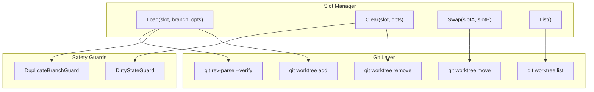
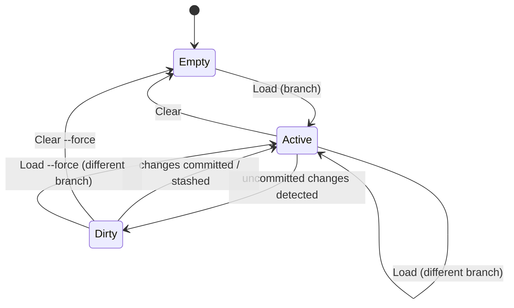

# コアスロット管理

## 1. Overview

Git Slot の中核機能であるスロットの CRUD 操作を定義する。スロットは TOML 設定で名前が定義され、gwq 準拠のパスに Git Worktree を配置する。ブランチの装填（Load）・解除（Clear）・入れ替え（Swap）・一覧表示（List）を提供する。

## 2. PRD (Product Requirements)

### 2.1 User Stories

#### US-CORE-001: スロットへのブランチ装填

> 開発者として、指定したスロットに既存ブランチを装填したい。それにより、固定パスで即座にそのブランチの作業を開始できる。

#### US-CORE-002: 新規ブランチの作成と装填

> 開発者として、新しいブランチを作成しつつスロットに装填したい。それにより、ブランチ作成とスロット割り当てを一度に行える。

#### US-CORE-003: スロットの解除

> 開発者として、使い終わったスロットを解除したい。それにより、スロットを別のブランチに再利用できる。

#### US-CORE-004: スロット一覧の確認

> 開発者として、全スロットの現在の状態を一覧で確認したい。それにより、どのスロットが使用中か、どのブランチが割り当てられているかを把握できる。

#### US-CORE-005: スロット間のブランチ入れ替え

> 開発者として、2つのスロット間でブランチを入れ替えたい。それにより、作業の優先度変更に応じてスロット配置を調整できる。

#### US-CORE-006: ブランチ重複の防止

> 開発者として、同じブランチが複数のスロット（および gwq worktree）に装填されることを防ぎたい。それにより、意図しない競合を回避できる。

#### US-CORE-007: Dirty 状態の保護

> 開発者として、未コミットの変更があるスロットを誤って解除しないようにしたい。それにより、作業中のデータ損失を防げる。

### 2.2 Acceptance Criteria

| ID | ストーリー | 受け入れ条件 |
|----|-----------|-------------|
| AC-CORE-001 | US-CORE-001 | `git slot <slot> <branch>` で `slots/<slot>/` に worktree が作成される |
| AC-CORE-002 | US-CORE-001 | Load 後、スロットの状態が Active になる |
| AC-CORE-003 | US-CORE-002 | `git slot <slot> -c <new-branch>` で新規ブランチが作成され装填される |
| AC-CORE-004 | US-CORE-003 | `git slot -d <slot>` で worktree が削除され、スロットが Empty になる |
| AC-CORE-005 | US-CORE-003 | Dirty 状態のスロットに対して `clear` は確認プロンプトを表示する |
| AC-CORE-006 | US-CORE-004 | `git slot --list` で全スロットの名前・状態・ブランチ・dirty フラグが表示される |
| AC-CORE-007 | US-CORE-005 | `git slot --swap <A> <B>` で両スロットのブランチが入れ替わる |
| AC-CORE-008 | US-CORE-006 | 既に他スロットまたは gwq worktree で使用中のブランチを Load しようとするとエラーになる |
| AC-CORE-009 | US-CORE-007 | `--force` フラグで Dirty 状態の確認をスキップできる |

### 2.3 Out of Scope

- ブランチの作成・削除自体の管理（Git 本体の責務）
- マージ・リベース操作
- リモートリポジトリとの同期
- スロット名のハードコードされたプリセット（五行等）

## 3. TRD (Technical Requirements)

### 3.1 Architecture



### 3.2 Data Model

#### Slot 構造体

```go
type SlotState int

const (
    SlotEmpty  SlotState = iota // worktree が存在しない
    SlotActive                  // worktree が存在し、クリーンな状態
    SlotDirty                   // worktree が存在し、未コミットの変更がある
)

type Slot struct {
    Name     string    // TOML で定義されたスロット名
    Path     string    // worktree の絶対パス
    State    SlotState // 現在の状態
    Branch   string    // 装填中のブランチ名（Empty の場合は空文字）
    IsDirty  bool      // 未コミットの変更があるか
    HeadHash string    // HEAD の短縮ハッシュ
}
```

#### スロット状態遷移図



### 3.3 Implementation Details

#### 3.3.1 Load 操作

```
Load(slotName, branchName, opts):
  1. slotName が設定に定義されたスロット名か検証
  2. slot = ResolveSlot(slotName)

  3. IF slot.State == Dirty AND NOT opts.Force:
       return Error("未コミットの変更があります。--force で強制実行できます")

  4. IF branchName が他スロットまたは gwq worktree で使用中:
       return Error("ブランチ '{branch}' はスロット '{other}' で使用中です")

  5. IF opts.CreateBranch:
       IF branchName が既に存在:
         return Error("ブランチ '{branch}' は既に存在します")
       git worktree add <slot.Path> -b <branchName>
     ELSE:
       IF branchName がローカル/リモートに存在しない:
         return Error("ブランチ '{branch}' が見つかりません。-c で新規作成できます")
       IF slot.State != Empty:
         cd <slot.Path> && git checkout <branchName>
       ELSE:
         git worktree add <slot.Path> <branchName>

  6. RunHooks("post_load", slot)  // フック設定がある場合
  7. return Success
```

#### 3.3.2 Clear 操作

```
Clear(slotName, opts):
  1. slot = ResolveSlot(slotName)

  2. IF slot.State == Empty:
       return Error("スロット '{name}' は既に空です")

  3. IF slot.State == Dirty AND NOT opts.Force:
       IF NOT ConfirmPrompt("未コミットの変更があります。本当に解除しますか？"):
         return Cancelled

  4. RunHooks("pre_clear", slot)
  5. git worktree remove <slot.Path> [--force]
  6. RunHooks("post_clear", slot)
  7. return Success
```

#### 3.3.3 Swap 操作

```
Swap(slotNameA, slotNameB):
  1. slotA = ResolveSlot(slotNameA)
  2. slotB = ResolveSlot(slotNameB)

  3. IF slotA.State == Empty OR slotB.State == Empty:
       return Error("両方のスロットにブランチが装填されている必要があります")

  4. tempPath = <slots-base>/.swap-temp
  5. git worktree move <slotA.Path> <tempPath>
  6. git worktree move <slotB.Path> <slotA.Path>
  7. git worktree move <tempPath> <slotB.Path>
  8. return Success
```

#### 3.3.4 List 操作

```
List():
  1. slots = LoadSlotDefinitions(config)
  2. worktrees = ParseGitWorktreeList()

  3. FOR each slot IN slots:
       IF slot.Path が worktrees に存在:
         slot.State = Active
         slot.Branch = worktrees[slot.Path].Branch
         slot.HeadHash = worktrees[slot.Path].HeadHash
         slot.IsDirty = CheckDirtyState(slot.Path)
         IF slot.IsDirty:
           slot.State = Dirty
       ELSE:
         slot.State = Empty

  4. return slots
```

#### 3.3.5 パス解決（gwq 準拠）

gwq はデフォルトで `~/worktrees/{host}/{owner}/{repo}/{branch}` に worktree を配置する。git-slot はこの同じ階層内に `slots/` ディレクトリを作成する。

```
ResolveSlotsBasePath(config):
  1. IF config.slots_base_path が設定済み:
       return absolutePath(config.slots_base_path)

  2. // gwq 準拠のデフォルトパスを算出
     repoURL = git remote get-url origin
     repoInfo = ParseRepositoryURL(repoURL)
     // → host=github.com, owner=user, repo=myapp

  3. gwqBaseDir = config.gwq_basedir OR "~/worktrees"
  4. basePath = gwqBaseDir/{host}/{owner}/{repo}/slots
     // → ~/worktrees/github.com/user/myapp/slots
  5. return absolutePath(basePath)

ResolveSlotPath(slotName):
  1. basePath = ResolveSlotsBasePath()
  2. return filepath.Join(basePath, slotName)
```

### 3.4 Error Handling

| エラー状況 | エラーコード | メッセージ例 |
|-----------|------------|-------------|
| 未定義のスロット名 | E_SLOT_UNKNOWN | "スロット '{name}' は設定に定義されていません" |
| ブランチ未検出 | E_BRANCH_NOT_FOUND | "ブランチ '{branch}' が見つかりません。-c で新規作成できます" |
| ブランチ重複 | E_BRANCH_DUPLICATE | "ブランチ '{branch}' はスロット '{slot}' で使用中です" |
| スロット既空 | E_SLOT_ALREADY_EMPTY | "スロット '{name}' は既に空です" |
| Dirty 状態 | E_SLOT_DIRTY | "スロット '{name}' に未コミットの変更があります。--force で強制実行できます" |
| Swap 片方空 | E_SWAP_EMPTY | "Swap には両方のスロットにブランチが装填されている必要があります" |
| worktree 操作失敗 | E_WORKTREE_FAILED | "Git worktree 操作に失敗しました: {detail}" |
| リポジトリ外実行 | E_NOT_IN_REPO | "Git リポジトリ内で実行してください" |
| 設定未初期化 | E_NO_CONFIG | "git-slot.toml が見つかりません。`git slot --init` で作成してください" |

## 4. Phase / Priority

| 機能 | フェーズ | 優先度 |
|------|---------|--------|
| Load（既存ブランチ） | Phase 2 | P0 |
| Load（新規ブランチ作成） | Phase 2 | P0 |
| Clear | Phase 2 | P0 |
| List | Phase 2 | P0 |
| ブランチ重複検出 | Phase 2 | P0 |
| Dirty 状態検出・警告 | Phase 2 | P0 |
| Swap | Phase 2 | P1 |
| --force フラグ | Phase 2 | P1 |
| Load 時のブランチ切り替え（既存スロット） | Phase 2 | P1 |
