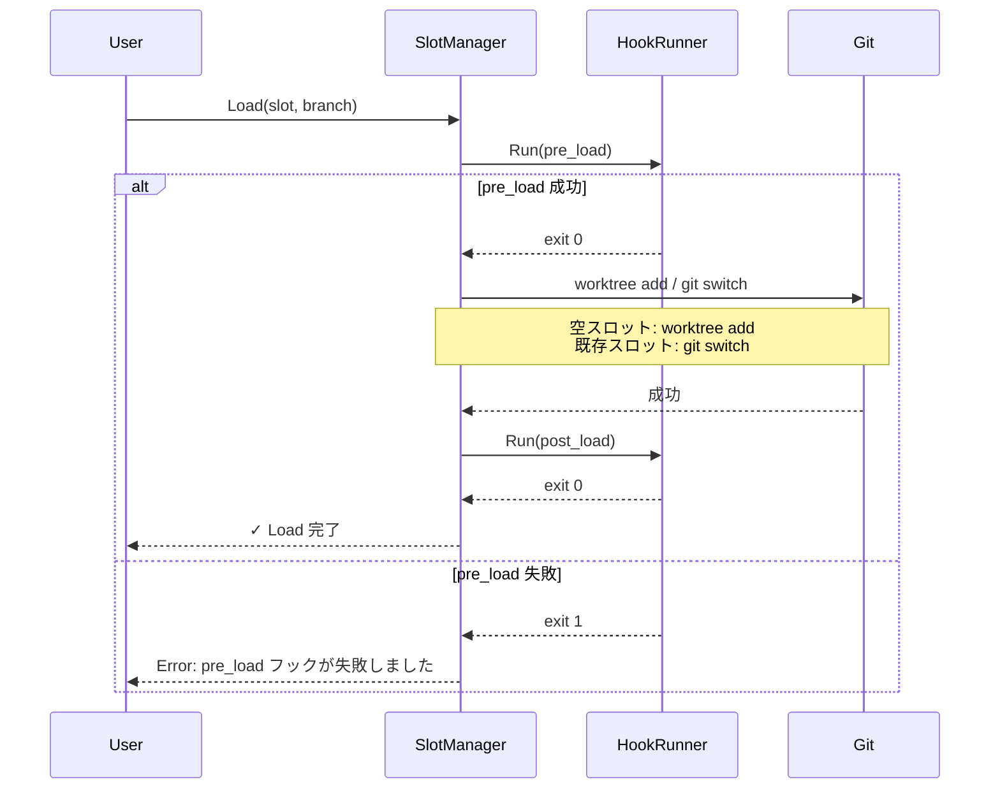

# 外部統合

## 1. Overview

Git Slot は gwq のディレクトリ規約と共存し、フック機構を通じて外部ツールとの統合を可能にする。Docker 統合は将来の検討事項として保留する。

## 2. PRD (Product Requirements)

### 2.1 User Stories

#### US-INT-001: gwq との共存

> gwq でリポジトリを管理している開発者として、git-slot が gwq のディレクトリ規約を尊重してほしい。それにより、両ツールを併用しても競合が発生しない。

#### US-INT-002: カスタムフック

> 開発者として、Load / Clear の前後にカスタムスクリプトを実行したい。それにより、依存関係のインストールやキャッシュクリアなどを自動化できる。

### 2.2 Acceptance Criteria

| ID | ストーリー | 受け入れ条件 |
|----|-----------|-------------|
| AC-INT-001 | US-INT-001 | スロットのパスが gwq の worktree 領域内に `{repo}@{slot}` 形式で作成される |
| AC-INT-002 | US-INT-001 | gwq の通常 worktree（`slots/` 外）に干渉しない |
| AC-INT-003 | US-INT-002 | `hooks.post_load` に指定したスクリプトが Load 後に実行される |
| AC-INT-004 | US-INT-002 | `hooks.pre_clear` に指定したスクリプトが Clear 前に実行される |

### 2.3 Out of Scope

- Docker .env 自動生成（保留: 最適な設計が未確定）
- gwq worktree のスロットへのバインド操作（将来検討）
- IDE プラグインの実装
- Kubernetes / Podman との統合

## 3. TRD (Technical Requirements)

### 3.1 gwq パス互換

#### ディレクトリ構造の共存

gwq はデフォルトで `~/worktrees/{host}/{owner}/{repo}/{branch}` に worktree を配置する（`worktree.basedir` + `naming.template`）。git-slot は同じ `{repo}/` 配下に `{repo}@{slot}` 形式でディレクトリを作成して共存する。

```text
~/worktrees/github.com/user/repo/     (gwq の worktree 領域)
├── repo@slot-A/                       ← git-slot 専用（{repo}@{slot} 形式）
├── repo@slot-B/
├── repo@slot-C/
├── feature-auth/                      ← gwq 通常 worktree
└── bugfix-login/                      ← gwq 通常 worktree
```

git-slot の worktree は `{repo}@{slot}` 形式で命名され、gwq の worktree と明確に区別できる。
`@` はリポジトリ名（`[a-zA-Z0-9._-]`）・スロット名（`[a-zA-Z0-9_-]`）どちらにも使用されない文字であるため、境界が一意に定まる。
git-slot は `{repo}@` プレフィックスを持つディレクトリのみを管理し、それ以外には一切触れない。

#### ブランチ重複検出の範囲

`git worktree list` の出力を解析し、git-slot のスロットだけでなく gwq の worktree も含めてブランチの重複を検出する。これにより、同一ブランチが複数の worktree に展開されることを防ぐ。

### 3.2 フック機構

#### 設定

```toml
[hooks]
pre_load = ".git-slot/hooks/pre-load.sh"
post_load = ".git-slot/hooks/post-load.sh"
pre_clear = ".git-slot/hooks/pre-clear.sh"
post_clear = ".git-slot/hooks/post-clear.sh"
```

#### 実行モデル

フックは指定されたスクリプトを子プロセスとして実行する。以下の環境変数がフックスクリプトに渡される:

| 環境変数 | 説明 | 例 |
|----------|------|-----|
| `GSL_SLOT_NAME` | スロット名 | `main-work` |
| `GSL_SLOT_PATH` | スロットの絶対パス | `/home/user/src/.../repo@main-work` |
| `GSL_BRANCH` | ブランチ名 | `feature/nice-ui` |
| `GSL_REPO_ROOT` | ベースリポジトリのルート | `/home/user/src/.../repo` |
| `GSL_ACTION` | 実行中のアクション | `load` / `clear` |
| `GSL_SHELL_SESSION` | スロットシェル内かどうか | `1`（シェル内のみ設定） |

#### 実行ルール

- フックスクリプトは実行権限（`chmod +x`）が必要
- `pre_*` フックが非ゼロで終了した場合、本体操作は中止される
- `post_*` フックが非ゼロで終了した場合、警告を表示するが操作自体は完了済み
- フックのタイムアウトは 30 秒
- フックの stdout / stderr はそのまま表示される

#### 実行フロー



### 3.3 サブシェル統合

`git slot shell` または `launch_shell = true` 時の `set` / TUI は、スロットの worktree 内でサブシェルを起動する。このシェルには以下の環境変数が追加される:

- `GSL_SHELL_SESSION=1` — ネスト検出用
- `GSL_SLOT_NAME`, `GSL_SLOT_PATH`, `GSL_BRANCH`, `GSL_REPO_ROOT` — スロット情報
- `[[slots]] env` で定義されたユーザー定義変数

#### ネスト防止ルール

| 状況 | 動作 |
|------|------|
| スロットシェル外 | すべての操作を通常どおり実行 |
| スロットシェル内で `git slot shell` | エラー |
| スロットシェル内で `git slot set <同じスロット>` | 許可（ブランチ切り替えのみ） |
| スロットシェル内で `git slot set <別スロット>` | エラー |
| スロットシェル内で `git slot`（TUI） | エラー（launch_shell=true 時） |

### 3.4 Error Handling

| エラー状況 | エラーコード | メッセージ例 |
|-----------|------------|-------------|
| フックスクリプト未検出 | E_HOOK_NOT_FOUND | "フックスクリプトが見つかりません: {path}" |
| フック実行権限なし | E_HOOK_PERMISSION | "フックスクリプトに実行権限がありません: {path}" |
| フックタイムアウト | E_HOOK_TIMEOUT | "フックが 30 秒以内に完了しませんでした: {path}" |
| pre_* フック失敗 | E_HOOK_PRE_FAILED | "pre_{action} フックが失敗しました（exit code: {code}）。操作を中止します" |
| post_* フック失敗 | W_HOOK_POST_FAILED | "警告: post_{action} フックが失敗しました（exit code: {code}）。操作自体は完了しています" |

### 3.5 将来の検討事項

#### Docker 統合（保留）

スロットごとに `.env` を自動生成し、`COMPOSE_PROJECT_NAME` や `PORT` を隔離するアイデアがある。しかし以下の設計課題が未解決:

- ポート番号の割り当て戦略（固定 vs 動的 vs 設定ベース）
- `.env` の管理責任（git-slot が生成するか、フックに委ねるか）
- 既存の `.env` との競合回避

当面はフック機構を通じてユーザーが独自に実装することを推奨する。

#### gwq worktree のバインド

gwq で作成済みの worktree をスロットに取り込む `git slot bind` コマンドも将来的に検討する。

## 4. Phase / Priority

| 機能 | フェーズ | 優先度 |
|------|---------|--------|
| gwq パス互換（ディレクトリ配置） | Phase 1 | P0 |
| gwq worktree を含むブランチ重複検出 | Phase 2 | P0 |
| フック機構（pre/post） | Phase 3 | P2 |
| Docker 統合 | 保留 | - |
| gwq worktree バインド | 将来 | - |
