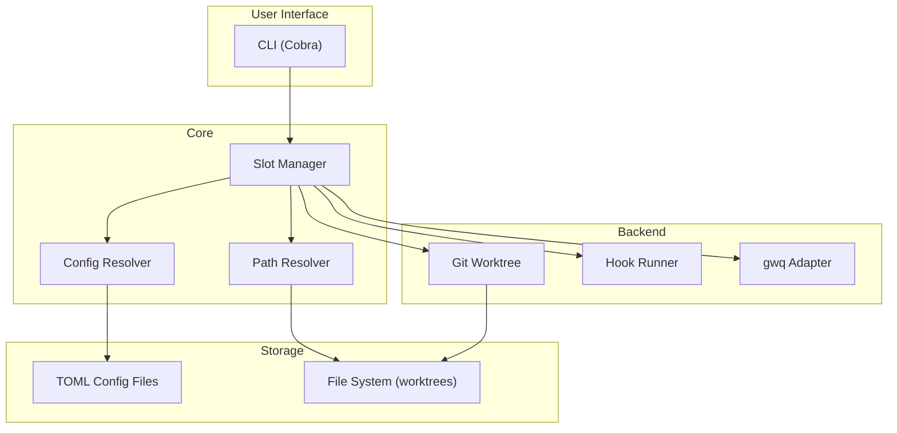

# Git Slot — プロダクト概要

## 1. Overview

### 1.1 プロダクトビジョン

Git Slot（バイナリ名: `git-slot`）は、Git Worktree を「固定された作業スロット」として管理する CLI ツールである。`PATH` に配置することで `git slot <subcommand>` として Git のサブコマンドとして動作する。ブランチ中心の運用から「作業台（Slot）中心」の運用へシフトし、コンテキストスイッチの最小化と開発環境の安定化を実現する。

### 1.2 解決する課題

- **パスの不安定性**: ブランチ名ベースの worktree はパスが毎回変わり、IDE 設定やビルドキャッシュが壊れる
- **コンテキストスイッチのコスト**: ブランチ切り替えのたびに環境の再構築が必要
- **worktree の散乱**: 命名規則なしに worktree を作ると管理が煩雑になる

### 1.3 コアコンセプト

- **Fixed Workspace**: スロットは TOML 設定で定義された固定名を持ち、パスが安定する
- **Slot-Centric**: ブランチではなくスロットを中心に作業を管理する。ブランチはスロットに「装填（Load）」する
- **Encapsulated for gwq**: gwq 管理下のディレクトリ内に `slots/` 階層を配置し、既存ツールと共存する
- **Configurable**: スロットの名前・数・属性はすべて TOML 設定で定義。デフォルトのプリセットは持たない

### 1.4 ターゲットユーザー

- 複数ブランチを並行して開発するエンジニア
- gwq を利用して Git Worktree を管理しているユーザー
- IDE のパス固定やビルドキャッシュの安定化を求めるユーザー

## 2. システムアーキテクチャ

### 2.1 全体構成



### 2.2 ディレクトリ構造（gwq 準拠）

gwq はデフォルトで `~/worktrees/{host}/{owner}/{repo}/{branch}/` にworktree を配置する（`worktree.basedir` + `naming.template` による）。git-slot はこの同じ階層内に `slots/` ディレクトリを作成して共存する。

```text
~/worktrees/github.com/user/repo/    (gwq の worktree 領域)
├── slots/                            ← Git Slot 専用
│   ├── <slot-name-A>/                (設定で定義されたスロット)
│   ├── <slot-name-B>/
│   └── <slot-name-C>/
├── feature-auth/                     (gwq 通常 worktree)
└── bugfix-login/                     (gwq 通常 worktree)
```

### 2.3 技術スタック

| カテゴリ | 技術 | 用途 |
|----------|------|------|
| 言語 | Go (Golang) | メイン実装 |
| CLI フレームワーク | [Cobra](https://github.com/spf13/cobra) | コマンドパーサー |
| 設定パーサー | [pelletier/go-toml](https://github.com/pelletier/go-toml) | TOML 設定ファイル |
| テスト | Go 標準 `testing` + [testify](https://github.com/stretchr/testify) | ユニットテスト |

### 2.4 将来のオプション（現時点では対象外）

| 機能 | 状態 | 備考 |
|------|------|------|
| TUI ダッシュボード (Bubble Tea) | オプショナル | コア CLI が安定した後に検討 |
| Docker .env 統合 | 保留 | 最適な設計が未確定 |

## 3. フィーチャーマップ

### Phase 1: Foundation

- 設定システム（TOML 読み込み、階層マージ）
- パス解決ロジック（gwq 準拠）
- Git リポジトリ検出

### Phase 2: Core Operations

- `git slot <slot> <branch>` — スロットへのブランチ装填
- `git slot -d <slot>` — スロットの解除
- `git slot --list` — スロット一覧表示
- `git slot --swap <A> <B>` — スロット間のブランチ入れ替え
- 安全ガード（ブランチ重複検出、dirty 状態警告）

### Phase 3: Usability

- `git slot --init` — 設定ファイル生成
- `git slot --status` — スロット詳細表示
- シェル補完（bash/zsh/fish）
- フック機構（pre/post スクリプト）

### Future (未定)

- TUI ダッシュボード
- Docker 統合
- gwq worktree のバインド操作
